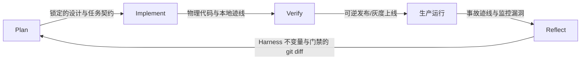

> AI 驱动开发方法论 ｜ 第一部分 · 理论与心智模型
> 目录见 [README](README.md)

# 全局地图：主循环与 Reflect 外环

心智模型、Harness 回路与人在回路为研发构筑了静态的安全防线。但真实项目在时序上面临更严酷的挑战：如果缺乏一张全局的时序地图，Agent 往往会在该做方案锁定的时候就开始写代码，在该做独立评审时完成自我合规盖章，或者在需要进行行为验证时仅仅草率查阅了一下单元测试的绿灯。这种错位源于在不同时序阶段角色视角的缺失。

**AI 驱动研发的主生命周期包含两套节奏：每个任务必须跑通的三步内循环（Plan → Implement → Verify），以及跨迭代的 Reflect 外环——它负责把教训转化并回写进 Harness。**

## 三步内循环

* **Plan（规划）**：以六问质疑挑战原始问题本身，通过多视角评审收敛技术方案，最终拆分为边界清晰、无状态重叠的冷启动任务。此阶段的产出全部为文档。
* **Implement（实现）**：在无上下文墙（Monorepo）、有强制边界（分层与依赖守卫）、可安全并行（Worktree 隔离）且能即时反馈的高产环境下进行编码与日志埋点。
* **Verify（验证）**：构建由即时门禁、独立评审、业务验收和可逆上线组成的阶梯式防御系统，每一级抓取前一级遗漏的逻辑与行为缺陷。

这三个阶段构成刚性的接力逻辑：前一步的交付物即为下一步的输入契约。锁定的设计文档喂给实现，实现的物理代码喂给验证，不留任何执行死角。

为什么是三步而不是更繁复的步骤？从研发实践看，“规划、实现、验证”是可闭环的最小研发单元。将注意力聚焦于这三个节点，能够让每个阶段的角色帽子与产出交付物定义得清晰而严密，避免流于机械的流程打卡。

本书的三步内循环模型源自 `gstack` 的 `Think → Plan → Build → Review → Test → Ship → Reflect`，其映射折叠关系为：
* `Think` 归入 `Plan` 阶段（质疑问题本身）；
* `Build` 对应 `Implement` 阶段；
* `Review` + `Test` + `Ship` 合并为 `Verify` 阶段（验证是一架包含检查、评审、验收和上线的梯子）；
* `Reflect` 独立为跨迭代的 `Reflect` 外环。

> [!NOTE]
> **发布即验证**：`Ship`（发布上线）并不占独立节点，而是 `Verify` 阶段延伸向生产环境的一条出站边。可逆迁移、灰度探测和自动回滚等生产动作，本质上都是验证在线上环境的物理延伸。

## Reflect 为什么是外环

Reflect（复盘）跑在与内循环完全不同的时钟周期上。Plan、Implement 和 Verify 随每个细分任务高频流转，而复盘则是发生于里程碑交付、系统事故或跨周迭代等周期节点上的低频重塑动作。若将复盘强行作为内循环的第四步，必然导致每次提交的复盘流于形式，退化为无意义的内容填充。

由于大模型在不同会话（Session）之间不存在天然的状态继承，Harness 脚手架便成为其唯一的持久化记忆载体。Reflect 是系统唯一的“写入持久记忆”通道。

复盘的核心职责是将本轮迭代或故障中暴露的缺陷，固化为 `./AGENTS.md` 条目、CI 静态检查规则和红线禁止项。它将教训转化为机器必须强制拦截的物理约束，进而抬高下一轮 Plan 的起点。复盘的合格交付物必须是对 Harness 配置文件的 `git diff`，而不是一篇人文学科式的感想总结。

## 阶段不等于承重柱

地图标示的是随时间推移的**开发阶段**，而 Harness 三件套则是横切全局的**承重柱**（文档、设计、检查、反馈）。承重柱是跨阶段存在的基础设施，而非单一时序下的工位。

判定标准：**只在某个特定时间点起作用的是阶段；横跨多阶段并持续发挥校验或约束作用的是承重柱。** 文档与设计作为冷启动输入必须在开工前就位；检查门禁（静态 Linter、单测）在实现时即开始在 pre-commit 中拦截，在验证时作为最底层门禁跑全量；可观测性反馈在实现时写入埋点，在验证阶段作为诊断依据，在复盘阶段指导策略回写。把横切的承重柱误当成时序阶段，会导致严重的架构性错位。

## 角色切换与右尺寸

在内循环的推进中，你需要根据所处阶段，为 Agent 切换不同的帽子：
* **Plan**：先戴上**发现者**的帽子挑战伪需求，再戴上**工程评审员**的帽子论证并发、幂等和边界溢出。
* **Implement**：戴上**环境构建者**的帽子，为 Agent 铺设带有护栏的专用跑道。
* **Verify**：先戴上**破坏者**的帽子寻找逻辑漏洞和注入攻击，再戴上**最终用户**的帽子核对无头浏览器截图与交互行为。

刻意切换帽子，是为了打破同一上下文下的惯性盲区。

同时，内循环的精细度应当根据改动风险进行“右尺寸”伸缩，而非机械执行：
* **低风险改动**（修一处文案或后台提示语）：Plan 仅需一句话边界，Implement 阶段单 Agent 开工，Verify 采用本地 Lint 加 Agent 自检即可放行。
* **高风险改动**（涉及资金、权限、数据迁移或核心计费）：必须跑全量闭环——多视角评审方案、多 Worktree 并行、刚性幂等黄金测试、干净上下文独立评审、Playwright 端到端截图自验证、以及 Expand-and-Contract 双向可逆数据库上线。

## Relay 演练：小额退款自动分流

以 Relay 客服 SaaS 的“自动退款分流”特性为例，演示其在全局地图上的时序轮转：

1. **Plan 阶段**：业务意图为“增加自动退款以节省客服精力”。Agent 在六问发散阶段挑战该方案，梳理出大额退款存在欺诈风险，从而把方案收拢至“仅对 500 元以下小额订单且无欺诈记录的客户进行自动分流”。多视角评审锁定了自动退款额度阈值和风控网关拦截，输出设计文档 `docs/designs/refund_v1.md`，并在 `./TODOS.md` 中拆分为三个前置任务：`feat/idempotency_add`（退款接口幂等加固）、`feat/gateway_retry`（网关超时重试逻辑）、`feat/refund_ui_cents`（前端分改元显示）。
2. **Implement 阶段**：开发人员使用 `git worktree` 同时拉起两个隔离的本地分支（`wt-idempotency`，`wt-retry`），两个 Agent 会话在各自被隔离的端口和沙箱数据库下并行开发，互不干扰，且在日志中预埋了统一的 `conversation_id` 与 `error_reason`。
3. **Verify 阶段**：CI 自动门禁拦截了 Agent 误用的浮点数；黄金测试集通过模拟高并发重试断言了幂等锁的可靠性；独立评审抓出了主写 Agent 自身满载的“自我评审”逻辑偏向；Playwright 端到端浏览器测试执行并生成了详情页截图作物证；最终发布时，Agent 通过 CLI 执行 1% 灰度部署并进行线上探测。
4. **Reflect 阶段**：线上排障发现深夜网关拥堵超时。教训没有停留在口头。团队修改 `./AGENTS.md` 写入红线“网关超时必须采用指数退避与随机抖动（Jitter）”，并在 CI 中新增了延迟注入门禁。

## gstack 参考实现

在 `gstack` 套件中，Plan 阶段使用 `/office-hours`（六问质疑）与 `/plan-review`（多视角评审）进行收敛；Implement 阶段依靠 `worktree` 隔离脚本与 SessionStart hook 装配环境；Verify 阶段依托 `/review`（独立上下文评审）、`/qa`（Playwright 自动运行）及 `/ship` 阶梯式递进；Reflect 阶段通过 `/retro` 将规则沉淀回 `./AGENTS.md`。

无论选用什么替代工具，**三步内循环配合一条向 Harness 回写约束的外环**，这一核心结构在任何架构中均不应发生改变。

## 典型反模式

* **跳过 Plan 阶段直接写码**：在含糊的语义指令下让 Agent 盲目编码。其高吞吐会在几分钟内产生大量方向性错误的沉没代码，极大抬高返工成本。
* **将 Verify 矮化为“测试绿灯”**：以为 CI 通过即代表交付完成，不做浏览器行为自验证，忽略前端交互与渲染缺陷。
* **复盘只写感悟，不写 Harness 的 diff**：复盘会流于形式，未能将逻辑教训转化为 CI 静态规则或 `./AGENTS.md` 红线，导致下个迭代重复犯错。
* **流程臃肿导致反弹**：忽视改动风险分档，强迫低风险的文案修改也去执行全套灰度与多视角会审，降低研发吞吐。

## 本章要点

* **内循环三步流转**：每个开发任务都必须走完 Plan → Implement → Verify，每步切换帽子、交付物互为契约。
* **Reflect 外环写入记忆**：复盘是跨周期的低频动作，其唯一合格的产出是 Harness 的 `git diff`，用来抬高下一次 Plan 的起点。
* **发布是验证的生产延伸**：上线并非独立节点，而是 Verify 阶段在线上环境的物理探测与灰度表现。
* **明确承重柱与时序阶段的边界**：承重柱是贯穿始终的工具链与基础设施，阶段是时序上的工作节点。
* **按风险右尺寸收放流程**：验证不可缩减，但规划与并行规模必须按风险分档，实现研发效能与风险的最优匹配。

---

下一章进入第二部分，先搭两根开工前必须到位的承重柱：项目宪法与设计系统。
