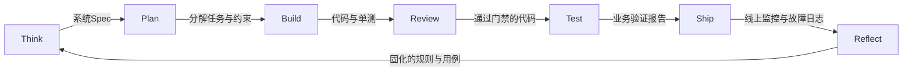

> AI 驱动开发方法论 ｜ 第一部分 · 理论与心智模型
> 目录见 [README](README.md)

# 全局地图：开发生命周期的七个阶段

在确立了角色心智、Harness 回路与人在回路的风控模型后，我们还需要一张全局视角的研发生命周期地图。从模糊的想法到线上持续运维，研发是一段漫长的旅程。仅凭心智模型无法避免在繁杂的细节中迷失方向，我们需要一条清晰的时间主线来指导每一步的动作与角色切换。

**研发项目全生命周期可以划分为七个阶段：Think、Plan、Build、Review、Test、Ship 与 Reflect。它们构成了一份防遗漏的关注点清单，而非强制每次提交都必须机械跑满的研发仪式。**

这套生命周期模型提炼自业界高频迭代的工业级实践，其核心价值在于“防遗漏”：每个阶段都对应一类研发过程中极易被跳过、但跳过后会引发技术债的环节。

## 七个阶段的研发关注点

* **Think（需求与架构构想）**：在动手编码前确保解决正确的问题。挑战不合理的假设，挖掘隐含的非功能性需求，对比多种备选方案。其产出是一份指导后续开发的系统设计文档（System Design Spec）。
* **Plan（方案锁定与任务拆解）**：从业务边界、系统架构、设计合理性等不同视角评审方案，锁定改动范围，并将其拆解为 Agent 可以独立领取的细粒度任务。
* **Build（并行编码实现）**：基于锁定的方案开展并发编码。在此阶段，多个 Agent 可在隔离的 `worktree` 中独立推进各自的模块。
* **Review（静态门禁与人机评审）**：结合静态分析、安全工具与人类开发者的评审，捕捉 CI 静态检查无法覆盖的业务逻辑漏洞与深层安全隐患。
* **Test（端到端与业务验证）**：不仅依赖基础的单测绿灯，还要强制 Agent 模拟用户交互路径进行全链路演练，核对最终的业务指标与表现。
* **Ship（灰度合并与部署上线）**：合并主干、执行部署并验证线上服务健康度。在高风险或不可逆操作中，设计完备的灰度与快速回滚方案。
* **Reflect（复盘与约束沉淀）**：分析迭代中遭遇的漏洞与设计盲区，将教训固化为 `./AGENTS.md` 中的硬约束、Lint 规则以及测试用例，将技术债转化为 Harness 系统的演进复利。

在不同的阶段，开发者需要主动切换思考的视角：Think 阶段以产品与架构视角权衡需求；Plan 阶段以设计者视角分解任务；Review 阶段以严苛的反向破坏者视角审视漏洞；Test 阶段以最终用户的视角研判体验。角色视角的刻意切换，是为了避免在同一认知上下文中产生惯性盲区。

## 阶段间的咬合与控制流接力

七个阶段并非孤立的信息孤岛，而是前后紧密咬合的控制流接力：



这一接力链本质上是“文档、检查、反馈”回路在研发生命周期上的时间轴展开。系统 Spec 与 Reflect 的产出是**文档**输入；Build 与 Review 阶段负责执行强制性**检查**；Test 和 Ship 阶段则负责向系统输出真实运行的**反馈**。整张地图与核心 Harness 回路互为表里。

## 按需裁剪，灵活伸缩

必须明确的是，这一七阶段地图是为中大型特性或完整系统级迭代设计的“防遗漏清单”，而非每次修复拼写错误都必须机械跑满的僵化仪式。在实际应用中，应当根据改动风险的大小对各阶段的执行深度进行弹性裁剪：

* **核心硬红线**：Review 与 Test 阶段在任何改动下都不可省。无评审、无验证的直接合并是线上事故的高发诱因。
* **弹性裁剪度**：例如对于内部统计后台的新增页面，Think 与 Plan 阶段仅需一份简短的字段清单与接口定义，Build 也可以单 Agent 快速完成；而对于重构计费或支付等资金交易特性，则必须组织多视角的详细方案会审，并启动多 Agent 并行开发与深度黄金 Evaluator 压测。
* **决策依据**：判断在哪些阶段需要收紧或裁剪，其决策依据正是上一章所探讨的“信任校准”心智。

## Relay 演练：退款特性的七阶段运转实录

以 Relay SaaS 系统的“超时重试自动退款”特性为例，演示其如何完整走完七个阶段：

1. **Think**：梳理退款幂等逻辑，在 `./docs/specs/refund_spec.md` 中确认：退款模块必须支持幂等防重放，并限制单次交易上限为 10,000 分，超时重试间隔必须呈指数级退避。
2. **Plan**：调用 Plan 模式。Agent 提交了修改计划方案。团队联合审阅了其数据库 Schema 变更（增加 `idempotency_key` 字段的唯一索引），确认无误后锁定方案，将任务拆解为：退款接口幂等加固、外部支付网关重试、以及前端退款状态更新。
3. **Build**：两个 Agent 分别在独立的 `worktree` 分支中并行编写接口与网关代码。
4. **Review**：提交 Pull Request 后，CI 中的 Lint 检查全绿。但在人机代码评审中，人类发现 Agent 在重试机制中将幂等键的过期时间误设为 5 秒，容易在极端网络延迟下失效。人类在 PR 中发表评审意见：
   ```markdown
   [Review Comment] Idempotence lock expiry of 5s is too short under peak latency. Increase to 5 minutes to prevent race conditions.
   ```
   Agent 捕获这一反馈，将超时配置修改为 5 分钟。
5. **Test**：本地单元测试完成后，Agent 启动无头浏览器模拟完整的沙箱测试：模拟弱网超时重试，抓取支付 API 日志，确认下游支付平台没有发生重复扣款，并输出自验证报告 `test_report.md`。
6. **Ship**：触发自动化灰度流水线，先将 1% 的商户对话流量路由至新退款服务，监控核心业务指标 `failed_refund_rate`，确认平稳后全量发布。
7. **Reflect**：在全量上线后，发现由于支付渠道的零点清算，偶尔会出现短时的超时尖峰。为了防止该清算阶段的重试雪崩，人类引导 Agent 总结教训，在 `./.agents/rules.md` 中追加规则：“所有网络重试策略必须带有随机抖动抖变（Jitter）”，并在 CI 测试库中新增清算期延迟毛刺的黄金测试用例。

在这一闭环中，每一个阶段都沉淀了相应的安全工件，使得下一个功能的迭代有了更加稳固的环境基底。

## 典型反模式

* **无预设编码（跳过 Think/Plan）**：直接让 Agent 开始编写复杂业务。即使它以极快的速度堆砌出数千行代码，往往会因为核心数据流或设计方向错误，面临整体返工的惨重代价。
* **测试绿灯即正确（跳过 Test）**：完全用 CI 测试的“通过”替代真实业务流演练。测试通过仅代表无编译或类型签名错误，无法证明在真实用户交互中业务流程的逻辑正确。
* **过度仪式化（丧失弹性）**：将七阶段视作僵化的教条，给改动一行拼写文案也执行全套灰度、多方方案评审与详细复盘，导致研发流程沉重不堪，最终引发团队反弹并彻底弃用该方法论。

## 本章要点

* **生命周期全局地图**：包含 Think、Plan、Build、Review、Test、Ship、Reflect 七个关键阶段，是一份旨在防止研发疏漏的关注点清单。
* **控制流咬合**：阶段间前后承接、互为输入输出，本质是检查反馈文档回路在时间轴上的展开。
* **弹性裁剪原则**：按需伸缩各阶段的执行深度。Review 与 Test 属于不可动摇的安全底线。
* **主动视角切换**：在不同阶段主动切换对应角色的思考视角，以打破研发的思维盲区。

---

第一部分到此结束，理论齐了。下一章起我们将进入第二部分，开始动手搭建这一研发脚手架，首先从项目宪法的配置与 Agent 协同原语的设计谈起。
