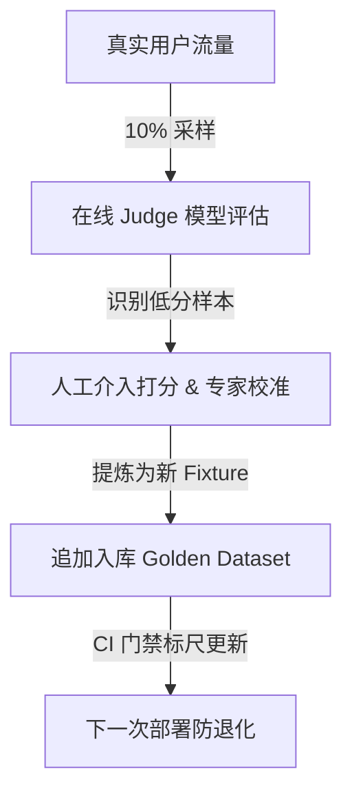

> AI 驱动开发方法论 ｜ 第七部分 · 对 AI 项目做 Eval
> 目录见 [README](README.md)

# 上线后在线评测与成本治理

CI 阶段的 Eval 门禁测试集无论多么精确，其测试基准本质上依然属于研发人员基于已知经验在“真空沙箱”中模拟出的黄金数据集（Golden Fixtures）。在系统上线后，真实用户的输入分布是极其丰富且动态转移的，同时大模型托管供应商（如 OpenAI、Anthropic）在远端悄悄进行的基础设施微调，极易在无感中使我们原本写好的系统提示词发生语义漂移。

**上线不代表可观测性工作的终结。必须在生产环境部署高频率的流量采样评测机制，将线上发现的漏网故障（False Negative）快速追加回黄金测试集，形成自适应防线。同时必须将大模型调用的 Token 消耗、高低端模型档位错配以及测试自身的跑批成本纳入可观测性监控大盘，以防止研发预算悄悄失控。**

## 在线评测回流闭环

为了确保系统的长期演进不会产生断层，我们必须为大模型行为引入“采样评测与回流”的质量闭环：



通过这一闭环，我们能够将线上的未知坏 case 迅速转化为研发期的已知拦截网，从根本上终结“同一类型的大模型错误线上反复发生”的恶性循环。

## 生产模型成本度量指标

对于引入大模型的应用而言，生产运营成本的最大头通常来自于 API 调用账单。如果缺乏度量工具，一次提示词重构如果无意中引入了“冗长且低价值的示例（Few-shots）”，或者让模型产生了“废话文学”，可能会导致生产成本瞬间产生数倍的膨胀。

因此，在线可观测性系统（如我们在第六部分配置的结构化日志）必须把每次大模型调用的底层 Token 用量和耗时作为标准字段持久化，以便于进行成本治理：

* **Input Tokens (输入 Token)**：记录提示词与上下文所占的物理长度。
* **Output Tokens (输出 Token)**：记录模型实际生成的文本长度。
* **Model Class (模型档位)**：标记当前请求由高端模型（如 `gpt-4o`/`claude-3-5-sonnet`）还是低成本模型（如 `gpt-4o-mini`/`haiku`）承载。

## 主线演练：Relay 在线成本失控日志与回流

在 Relay 系统中，由于大模型调用涉及实际计费，可观测性中间件自动将每次请求的底层指标序列化到大盘中。以下是系统捕获到的一条导致成本告警的异常 Trace JSON 迹线：

```json
{
  "level": 40,
  "time": 1782390100982,
  "trace_id": "t_llm_cost_981273",
  "event": "llm_call_completed",
  "model": "claude-3-5-sonnet",
  "cost_metrics": {
    "prompt_tokens": 14205,
    "completion_tokens": 284,
    "calculated_cost_usd": 0.04685,
    "latency_ms": 1890
  },
  "warnings": [
    "PROMPT_LENGTH_EXCEEDS_AVERAGE_BY_300_PERCENT"
  ],
  "msg": "LLM call cost triggered high-threshold alert. Large history context injected."
}
```

通过该日志，告警系统能够在单次对话费用突破 0.03 美元的物理预设线时，瞬间将问题上报至运维面板，避免了账单在静默中持续暴涨。

## 调试挫败细节：让月度账单失控的“客服历史聊天包”

在一期旨在“提高自动回复连贯性”的迭代中，Agent 在提示词组装模块里新增了一段逻辑：将该用户过去 30 天内的所有历史对话记录，全部作为上下文（Context）拼接在每次请求的前部发送给大模型。

在内测阶段，由于并发量极小，这一变动未引发任何注意。然而部署线上后的第一天中午，监控大盘突然亮起红色警报：大模型日均消费额由原本稳定的 80 美元一路狂飙至 1200 美元，Stripe 支付网关因高并发限流频频抛出 429 错误。

通过排查上面展示的 `llm_call_completed` 结构化日志，团队发现由于部分忠实用户历史会话量巨大，单次 API 请求塞入的 `prompt_tokens` 达到了惊人的 1.4 万个，而其中 90% 以上的历史信息与当前的自动退款毫无关系。

这次教训让团队立即采取了治理策略：
1. **上线 Token 熔断拦截器**：对于超出 3000 Token 的普通对话进行强制切片和摘要压缩。
2. **模型分层分流（Model Tiering）**：对于 90% 以上的简单常见分类，将模型底座由昂贵的 `claude-3-5-sonnet` 降级为仅需十分之一成本的 `gpt-4o-mini`，成功将月度费用压低了 82%，且综合解决率没有产生任何可观测的滑坡。

## 典型反模式

* **线上裸奔无监测**：代码上线后对大模型实际调用耗费的 Token、响应耗时、错误码完全不做指标归档与可视化，直到月底收到云服务商高额欠费单时才被动排查。
* **失败 Case 纯手工维护**：线上发现的大模型低级分类错误，仅由客服手动在 Excel 中记录，没有任何自动化流程能将其转换为开发期可复现的 Jest/Vitest fixture 样本，导致相同缺陷在下一次重构时被再次引入。
* **研发跑批无限度**：不限制 CI 上的并发测试上限，导致分支每一次提交都狂刷生产的付费 API，使测试本身的成本反超了应用生产运行的开销。

## 本章要点

* 在线采样评测是防范真实环境漂移与模型底座升级的终极防线，必须将结果对接可观测性告警系统。
* 线上发现的失败用例必须立刻转为 Golden Dataset 中的测试 Fixture 资产，以闭环形式沉淀防御能力。
* 必须主动开展大模型 Token 用量、响应延迟、价格趋势与模型档位的精细化度量与治理，设定刚性成本熔断阈值。

> 大模型在研发期与运行期的 Eval 双道防火墙已经合围。此时，大仓内的业务代码和提示词已经具备了出厂的标准。接下来，我们如何像经验丰富的工程师一样对这些代码进行人肉 Review 和安全威胁建模？我们将在第八部分 `评审、验证与交付` 中深入探讨。